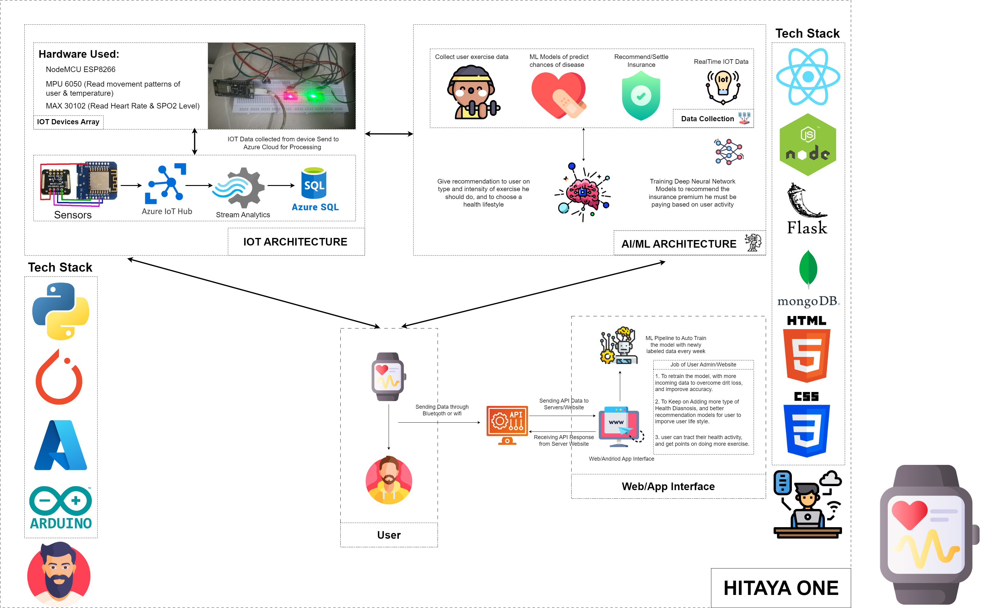

<h1 align="center"><a href="">Hitaya One Node API</a></h1>

### 1. Project Architecture

<p align="center">
  
</p>

### 2. Clone/Download the Repository

```
git clone https://github.com/IntelegixLabs/HitayaOne_Node_API.git
```

### 3. Run the Node Application

```
cd HitayaOne_Node_API
npm install
npm start
```

### 4. Run validations and Git Push

```
git push
```


### 5. Docker Build

```
cd HitayaOne_Node_API\docker\oneapi
docker-compose build
docker-compose up -d
```
