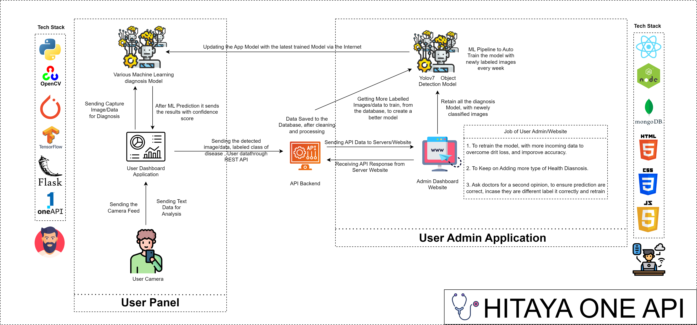
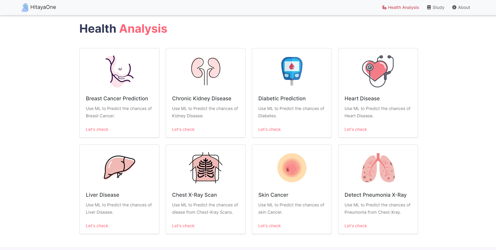
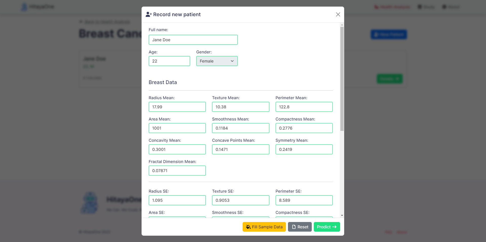
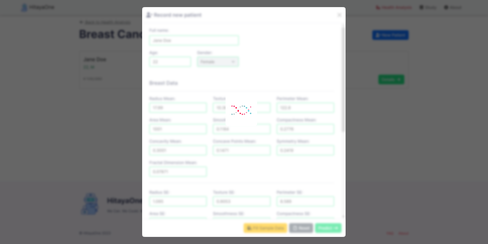
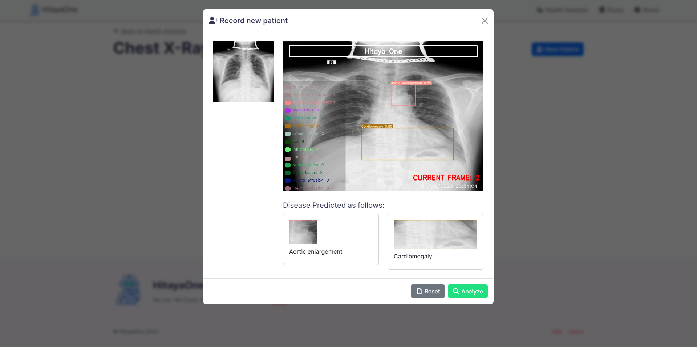
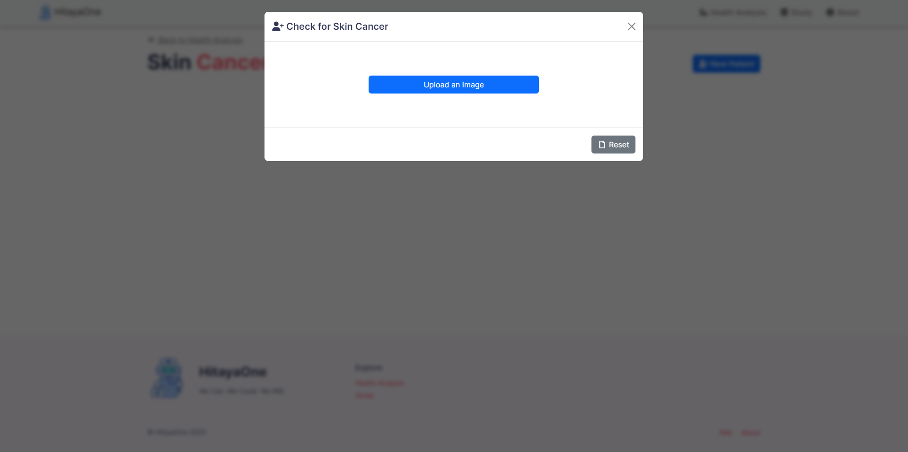
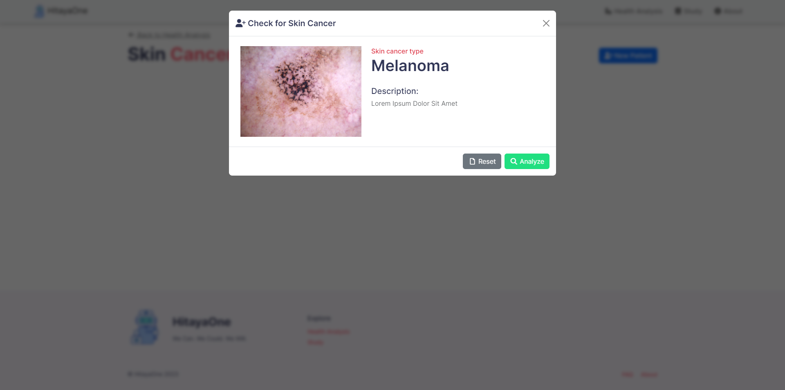
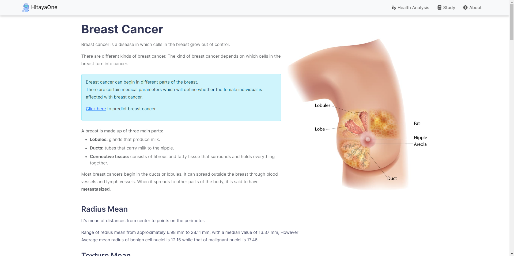

<h1 align="center"><a href="">Hitaya oneAPI</h1>
  
<strong>Hitaya oneAPI </strong>Medical diagnosis using machine learning - Machine Learning has been revolutionizing on healthcare domain. ML models can now detect patterns underlying diseases. In this way, AI techniques can be considered as the second pair of eyes that can decode patient health knowledge extracted from large data sets by summing up facts & observations of diseases. Due to the Covid-19 pandemic existing digital diagnosis methods are being preferred as people are willing to follow Covid norms & stay safe.


## Features
- Creating an AI/ML preliminary diagnosis application.
- Users/Doctors can input images of x-ray scans/ medical data/ or just images and our Application will give them the diagnosis results.


## 1. Project Architecture

<p align="center">
  
</p>


## 2. Getting Started With The Application

```sh
$ git clone https://github.com/IntelegixLabs/Hitaya_oneAPI.git
$ cd Hitaya_oneAPI
$ pip install -r requirements.txt
$ pip install -r requirements_gpu.txt
$ python app.py
```
  
### 3. Application Screenshots

<br />
<p align="center">
  
  
  
  
  
  
  
  
  
  
</p>
<br />
