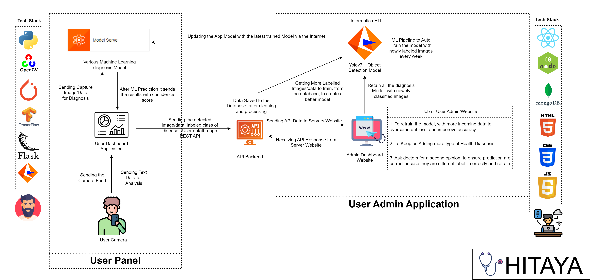
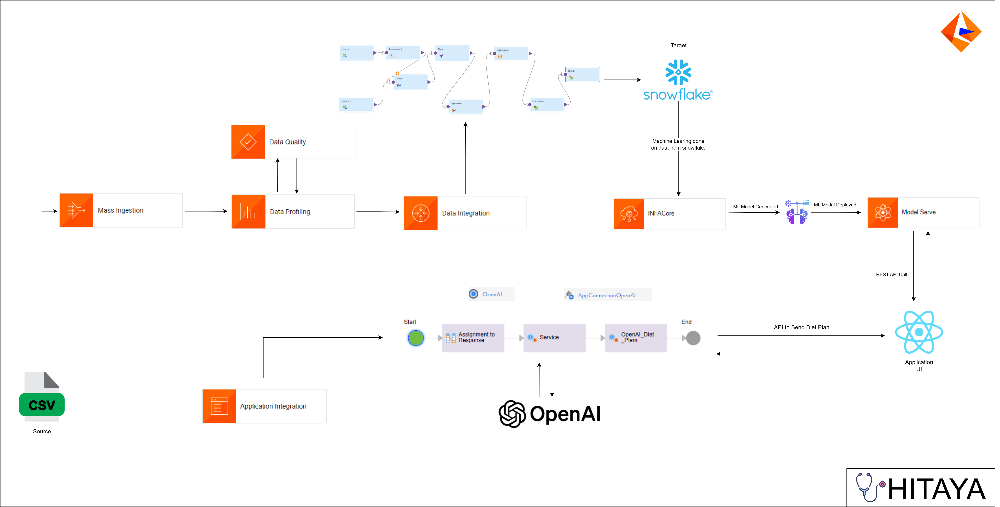
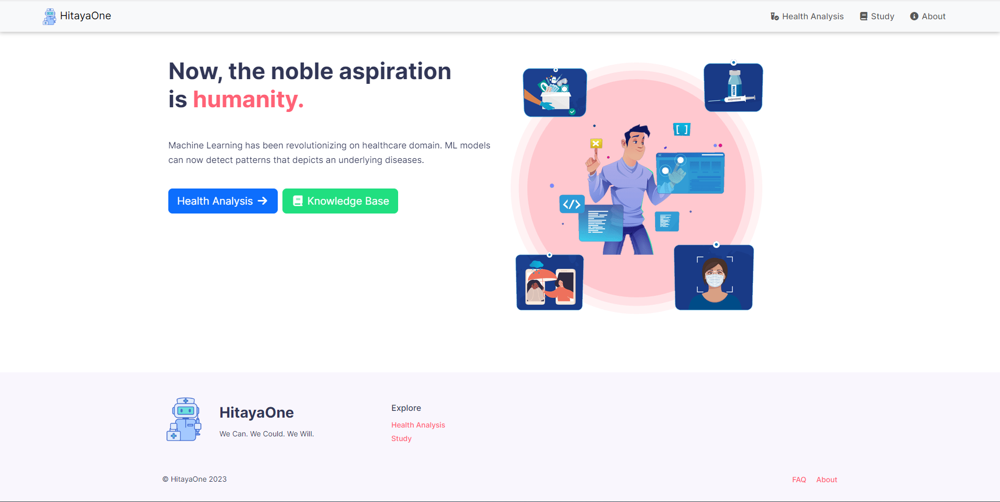
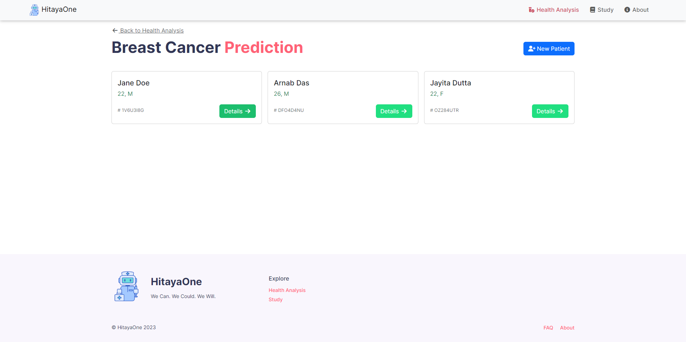
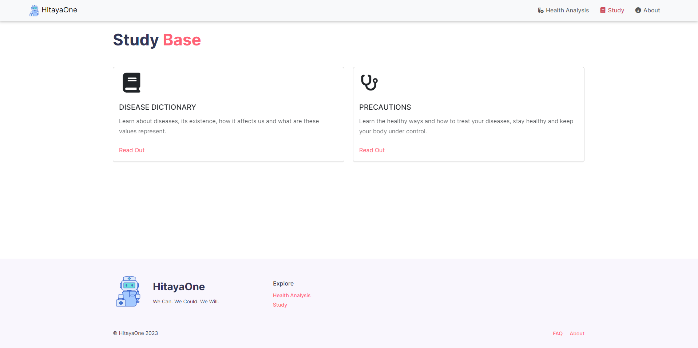

<h1 align="center">Hitaya Informatica</h1>

<strong>Hitaya</strong> is a one-stop solution, a medical diagnosis App that can allow users to upload medical data or x-ray scans, and the APP will predict whether a patient has any disease or not. 

Machine Learning has been revolutionizing on healthcare domain. ML models can now detect patterns underlying diseases. In this way, AI techniques can be considered as the second pair of eyes for doctors, that can decode patient health knowledge extracted from large data sets by summing up facts & observations of diseases.

## Features
- Creating an AI/ML preliminary diagnosis application.
- Users/Doctors can input images of x-ray scans/ medical data/ or just images and our Application will give them the diagnosis results.
- Using Generative AI to give user health Recommendations or Provide Diet Plans.
- Diagnostic System to predict the risk of a disease based on user data.
- Using Informatica create an ML pipeline that will re-train ML models from new data and upload the models using ModelServe for our UI to consume.

## List of Diseases it can predict now

- Breast Cancer
- Chronic Kidney Disease
- Diabetics
- Heart Disease
- Liver Disease
- Chest X-ray Scans
- Skin Cancer
- Pneumonia X-Ray

## 1. Project Architecture

  

 

## 2. Project Architecture Informatica

  

 

### 3. Application Screenshots

 

  
  
  
  
  
  
  
  
  
  

 
